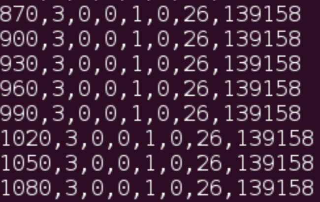

# README
**Vehicle Telematics** by Flink

## Description

Drivers, fleet owners, transport operations, insurance companies are stakeholders of vehicle monitoring applications which need to have analytical reporting on the mobility patterns of their vehicles, as well as real-time views in order to support quick and efficient decisions towards eco-friendly moves, cost-effective maintenance of vehicles, improved navigation, safety and adaptive risk management. 

Vehicle sensors do continuously provide data, while on-the-move, they are processed in order to provide valuable information to stakeholders. Applications identify speed violations, abnormal driver behaviors, and/or other extraordinary vehicle conditions, produce statistics per driver/vehicle/fleet/trip, correlate events with map positions and route, assist navigation, monitor fuel consumptions, and perform many other reporting and alerting functions. 

In this project we consider that each vehicle reports a position event every 30 seconds with the following format: *Time, VID, Spd, XWay, Lane, Dir, Seg, Pos* 

Being *Time* a timestamp (integer) in seconds identifying the time at which the position event was emitted, 

*VID* is an integer that identifies the vehicle,
 *Spd* (0 - 100) is an integer that represents the speed **mph (miles per hour)** of the vehicle, *XWay* (0 . . .L−1) identifies the highway from which the position report is emitted 

*Lane* (0 . . . 4) identifies the lane of the highway from which the position report is emitted (0 if it is an entrance ramp (ENTRY), 1 − 3 if it is a travel lane (TRAVEL) and 4 if it is an exit ramp (EXIT)). 

*Dir* (0 . . . 1) indicates the direction (0 for Eastbound and 1 for Westbound) the vehicle is traveling. *Seg* (0 . . . 99) identifies the segment from which the position report is emitted 

*Pos* (0 . . . 527999) identifies the horizontal position of the vehicle as the number of meters from the westernmost point on the highway (i.e., Pos = x) 

The goal of this project is to develop a program to implement the following functionality:

- **Speed Radar:** detects cars that overcome the speed limit of 90 **mph** 

- **Average Speed Control:** detects cars with an average speed higher than 60 **mph** between 

  segments 52 and 56 (both included) in both directions. If a car sends several reports on segments 52 or 56, the ones taken for the average speed are the ones that cover a longer distance. 

- **Accident Reporter:** detects stopped vehicles on any segment. A vehicle is stopped when it reports at least 4 consecutive events from the same position. 

There are some points need to be mentions: 

- All metrics are taken into account the direction field. 

- A given vehicle could report more than 1 event in the same segment. 

- Event time must be used for timestamping. 

- Cars that do not complete the segment (52-56) are not taken into account by the average speed 

  control. For example 52->54 or 55->56. 

- A car can be stopped on the same position for more than 4 consecutive events. 

  An accident report must be sent for each group of 4 events. For example, the next figure shows 

8 events for the car with identifier VID=3: 

The accident reporter should generate 5 accident alerts. (870->960, 900->990, 930->1020, 960- >1050, 990->1080). 

**Environments:**

Oracle Java 8, Flink 1.3.2

Ubuntu / MacOS
 

## Functions

1. **Speed Radar**: detects cars that overcome the speed limit of 90 mph
2. **Average Speed Control**: detects cars with an average speed higher than 60 mph between
   segments 52 and 56 (both included) in both directions. If a car sends several reports on segments 52 or 56, the ones taken for the average speed are the ones that cover a longer distance.
3. **Accident Reporter**: detects stopped vehicles on any segment. A vehicle is stopped when it reports at least 4 consecutive events from the same position. 

## Structure

**Input**: The Java program will read the events from a CSV with the format: `Time, VID, Spd, XWay, Lane, Dir, Seg, Pos`

An example file is available at [traffic-3xways-new.7z](http://lsd11.ls.fi.upm.es/traffic-3xways-new.7z). 

Our project has two parts to deal with three functions. BatchJob deals with Function 1 & 2 with Batch; StreamingJob address Function 3 with dataStream.

.

├── README.md

├── outputs

│   ├── accidents.csv

│   ├── avgspeedfines.csv

│   └── speedfines.csv

├── pom.xml

├── src

│   └── main

│       ├── java

│       │   └── vehicle

│       │       ├── BatchJob.java

│       │       ├── StreamingJob.java

│       │       └── define

│       │           ├── AccidentEvent.java

│       │           ├── AvgSpeedEvent.java

│       │           ├── Event.java

│       │           └── SpeedingEvent.java

│       └── resources

│           └── log4j.properties

├── traffic-3xways

└── trafficTest

## Usage

`$mvn clean package`

`$flink run -p 10 -c master2018.flink.VehicleTelematics target/$YOUR_JAR_FILE $PATH_TO_INPUT_FILE $PATH_TO_OUTPUT_FOLDER `

./bin/flink run -p 10 -c master2018.flink.VehicleTelematics ./master2018.flink.VehicleTelematics/target/flink-quickstart-java-1.3.2.jar ./trafficTest ./outputs

The output results are included in outputs folder. Because the input file "traffic-3xways" is too large, we did not include it here.

